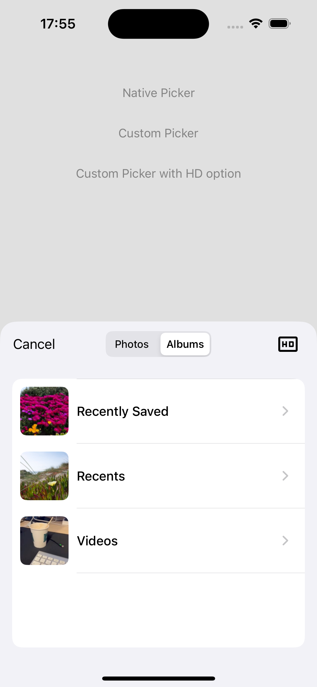

# IMPhotoPicker

A highly customizable photo and video picker for iOS, inspired by WhatsApp's media picker. Built with Swift and fully compatible with Objective-C.





## Features

- 🖼️ **Photo & Video Selection** - Support for photos, videos, or both
- 📱 **Multiple Presentation Styles** - Full screen, page sheet, or custom presentations
- 🔢 **Ordered Selection** - Visual indicators showing selection order
- 📝 **Input Bar** - Optional text input for adding captions (WhatsApp-style)
- 🎛️ **HD Mode Toggle** - Built-in toggle for high-quality media selection
- 🎨 **Highly Customizable** - Colors, fonts, buttons, and more
- 🔒 **Limited Access Support** - Handles iOS 14+ limited photo library access with a customizable banner
- 📂 **Albums View** - Switch between all photos and albums
- 🌍 **Localization** - Built-in support for English, Spanish, and Catalan

## Requirements

- iOS 14.0+
- Xcode 14.0+
- Swift 5.0+

## Installation

### Manual Installation

1. Copy the `IMPhotoPicker/Source` folder into your Xcode project
2. Add `NSPhotoLibraryUsageDescription` to your `Info.plist`

```xml
<key>NSPhotoLibraryUsageDescription</key>
<string>We need access to your photos to let you share them.</string>
```

## Usage

### Basic Usage

#### Swift

```swift
import UIKit
import Photos

class MyViewController: UIViewController, IMPickerViewControllerDelegate {
    
    func presentPicker() {
        let picker = IMPickerViewController()
        picker.delegate = self
        let nav = UINavigationController(rootViewController: picker)
        nav.modalPresentationStyle = .fullScreen
        present(nav, animated: true)
    }
    
    // MARK: - IMPickerViewControllerDelegate
    
    func pickerViewController(_ controller: IMPickerViewController, didFinishPicking selection: [PHAsset], hdModeEnabled: Bool) {
        print("Selected \(selection.count) items")
        controller.dismiss(animated: true)
    }
    
    func pickerViewControllerDidCancel(_ controller: IMPickerViewController) {
        controller.dismiss(animated: true)
    }
}
```

#### Objective-C

```objc
#import "IMPhotoPicker-Swift.h"

@interface MyViewController () <IMPickerViewControllerDelegate>
@end

@implementation MyViewController

- (void)presentPicker {
    IMPickerViewController *picker = [[IMPickerViewController alloc] init];
    picker.delegate = self;
    UINavigationController *nav = [[UINavigationController alloc] initWithRootViewController:picker];
    nav.modalPresentationStyle = UIModalPresentationFullScreen;
    [self presentViewController:nav animated:YES completion:nil];
}

#pragma mark - IMPickerViewControllerDelegate

- (void)pickerViewController:(IMPickerViewController *)controller didFinishPicking:(NSArray<PHAsset *> *)selection hdModeEnabled:(BOOL)hdModeEnabled {
    NSLog(@"Selected %lu items", (unsigned long)selection.count);
    [controller dismissViewControllerAnimated:YES completion:nil];
}

- (void)pickerViewControllerDidCancel:(IMPickerViewController *)controller {
    [controller dismissViewControllerAnimated:YES completion:nil];
}

@end
```

### With Input Bar (WhatsApp-style)

Use `IMPickerWrapperViewController` to include a text input bar at the bottom:

#### Swift

```swift
func presentPickerWithInputBar() {
    let picker = IMPickerWrapperViewController()
    let config = IMPickerConfiguration()
    
    config.rightButtonStyle = .hdModeToggle
    config.selectionOverlayBadgeColor = .systemGreen
    
    config.inputBarConfiguration = IMInputBarConfiguration()
    config.inputBarConfiguration?.placeholder = "Add a caption..."
    config.inputBarConfiguration?.sendButtonBackgroundColor = .systemGreen
    
    picker.configuration = config
    picker.delegate = self
    present(picker, animated: true)
}

// Delegate method
func pickerWrapperViewController(_ controller: IMPickerWrapperViewController, didTapSendWithText text: String, selection: [PHAsset], hdModeEnabled: Bool) {
    print("Send: \(text), \(selection.count) items")
    controller.dismiss(animated: true)
}
```

#### Objective-C

```objc
- (void)presentPickerWithInputBar {
    IMPickerWrapperViewController *picker = [[IMPickerWrapperViewController alloc] init];
    IMPickerConfiguration *config = [[IMPickerConfiguration alloc] init];
    
    config.rightButtonStyle = CustomPickerRightButtonStyleHdModeToggle;
    config.selectionOverlayBadgeColor = [UIColor systemGreenColor];
    
    config.inputBarConfiguration = [[IMInputBarConfiguration alloc] init];
    config.inputBarConfiguration.placeholder = @"Add a caption...";
    config.inputBarConfiguration.sendButtonBackgroundColor = [UIColor systemGreenColor];
    
    picker.configuration = config;
    picker.delegate = self;
    [self presentViewController:picker animated:YES completion:nil];
}

- (void)pickerWrapperViewController:(IMPickerWrapperViewController *)controller didTapSendWithText:(NSString *)text selection:(NSArray<PHAsset *> *)selection hdModeEnabled:(BOOL)hdModeEnabled {
    NSLog(@"Send: %@, %lu items", text, (unsigned long)selection.count);
    [controller dismissViewControllerAnimated:YES completion:nil];
}
```

## Configuration

### IMPickerConfiguration

| Property | Type | Description |
|----------|------|-------------|
| `assetTypeFilter` | `IMAssetTypeFilter` | Filter by `.all`, `.photos`, or `.videos` |
| `selectionLimit` | `Int` | Maximum selection count (0 = unlimited) |
| `rightButtonStyle` | `CustomPickerRightButtonStyle` | `.accept`, `.hdModeToggle`, or `.custom` |
| `customRightBarButtonItem` | `UIBarButtonItem?` | Custom right bar button |
| `cancelButtonNavigationItemTintColor` | `UIColor?` | Cancel button color |
| `leftNavigationItemTintColor` | `UIColor?` | Back button color |
| `rightNavigationItemTintColor` | `UIColor?` | Right button color |
| `selectionOverlayBadgeColor` | `UIColor?` | Selection badge color |
| `segmentedControlTintColor` | `UIColor?` | Segmented control background |
| `segmentedControlSelectedSegmentTintColor` | `UIColor?` | Selected segment color |

### IMInputBarConfiguration

| Property | Type | Description |
|----------|------|-------------|
| `placeholder` | `String?` | Placeholder text |
| `textFieldBackgroundColor` | `UIColor?` | Text field background |
| `textFieldFont` | `UIFont?` | Text field font |
| `sendButtonImage` | `UIImage?` | Send button image |
| `sendButtonTintColor` | `UIColor?` | Send button tint |
| `sendButtonBackgroundColor` | `UIColor?` | Send button background |
| `sendButtonBadgeColor` | `UIColor?` | Badge color |

### Limited Access Banner Configuration

| Property | Type | Description |
|----------|------|-------------|
| `showLimitedAccessBanner` | `Bool` | Show/hide the banner (default: `true`) |
| `limitedAccessBannerMessage` | `String?` | Custom message text |
| `limitedAccessManageButtonTitle` | `String?` | Custom "Manage" link text |
| `limitedAccessBannerMessageColor` | `UIColor?` | Message text color |
| `limitedAccessManageButtonColor` | `UIColor?` | "Manage" link color |
| `limitedAccessBannerFont` | `UIFont?` | Banner font |
| `limitedAccessActionSheetTitle` | `String?` | Action sheet title |
| `limitedAccessSelectMoreTitle` | `String?` | "Select more photos" text |
| `limitedAccessChangeSettingsTitle` | `String?` | "Change settings" text |

## Delegate Methods

### IMPickerViewControllerDelegate

```swift
// Required
func pickerViewController(_ controller: IMPickerViewController, didFinishPicking selection: [PHAsset], hdModeEnabled: Bool)
func pickerViewControllerDidCancel(_ controller: IMPickerViewController)

// Optional
func pickerViewController(_ controller: IMPickerViewController, didUpdateSelection selection: [PHAsset], hdModeEnabled: Bool)
func pickerViewControllerDidTapRightButton(_ controller: IMPickerViewController)
func pickerViewController(_ controller: IMPickerViewController, didFailWithPermissionError error: Error)
func pickerViewControllerDidAttemptToDismiss(_ controller: IMPickerViewController)
```

### IMPickerWrapperViewControllerDelegate

```swift
func pickerWrapperViewController(_ controller: IMPickerWrapperViewController, didTapSendWithText text: String, selection: [PHAsset], hdModeEnabled: Bool)
```

## Page Sheet Presentation (iOS 15+)

For a WhatsApp-style bottom sheet presentation:

```swift
func presentAsPageSheet(_ picker: UIViewController) {
    if #available(iOS 15.0, *) {
        picker.modalPresentationStyle = .pageSheet
        if let sheet = picker.sheetPresentationController {
            if #available(iOS 16.0, *) {
                sheet.detents = [
                    .custom { context in context.maximumDetentValue * 0.65 },
                    .large()
                ]
            } else {
                sheet.detents = [.medium(), .large()]
            }
            sheet.preferredCornerRadius = 20
        }
    }
    present(picker, animated: true)
}
```

## Limited Photo Library Access (iOS 14+)

When the user grants limited access to their photo library, IMPhotoPicker automatically shows a banner allowing them to:

- **Select more photos** - Opens the iOS limited library picker
- **Change settings** - Opens the app's settings page

This behavior can be customized or disabled via `IMPickerConfiguration`.

## Localization

The picker includes built-in localization for:
- 🇺🇸 English
- 🇪🇸 Spanish
- 🇪🇸 Catalan

To add more languages, create a new `.lproj` folder in `Source/Resources/` with the translated `IMPhotoPicker.strings` file.

## License

MIT License. See [LICENSE](LICENSE) for details.
